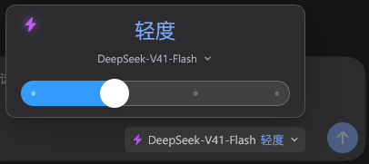
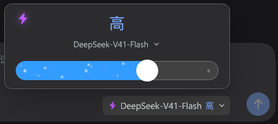
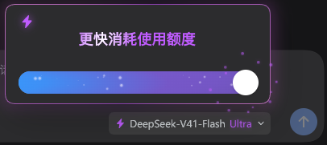
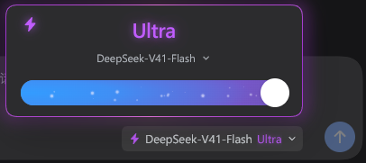

<div align="center">

# DeepSeek Harness · 推理强度滑块

**轻轻一滑，切换思考深度。**

为 DeepSeek Harness 打造的四档推理滑块与模型选择器，带有连续粒子过渡、极光渐变与 Ultra 流光效果。


[](LICENSE)

[界面预览](#界面预览) · [安装](#安装) · [使用](#使用) · [开发指南](docs/DEVELOPMENT.md) · [参与贡献](CONTRIBUTING.md)

</div>

> **兼容性**：当前版本在 Windows 的 DeepSeek Harness **0.2.0-rc.2** 上验证。Harness 尚处于预览阶段，后续版本可能需要适配。本项目是社区 UI 插件，通过 Harness 插件机制加载，不修改客户端安装文件。

## 界面预览

<table>
  <tr>
    <td width="50%" align="center">
      
      <br /><strong>轻度</strong> · 简洁的蓝色进度条
    </td>
    <td width="50%" align="center">
      
      <br /><strong>高</strong> · 四层空间粒子
    </td>
  </tr>
  <tr>
    <td width="50%" align="center">
      
      <br /><strong>进入 Ultra</strong> · 额度提示与粒子溅射
    </td>
    <td width="50%" align="center">
      
      <br /><strong>Ultra</strong> · 极光渐变与流光外发光
    </td>
  </tr>
</table>

*以上为实际界面截图；连续动画需安装后体验。*

## 特性

- **四档推理强度**：关、轻度、高、Ultra；支持拖动、点击、自动吸附和键盘切换。
- **真实模型切换**：读取 Harness 模型目录，可搜索模型名称，保留模型支持的推理档位。
- **连续动画反馈**：轻度到高逐渐显现粒子并加速；高到 Ultra 继续加速，极光渐变同步增强。
- **Ultra 专属效果**：紫色标题光晕、流光边框与同步外发光、单次圆粒子溅射，以及两秒额度提示。
- **稳定交互**：松手只提交一次设置，保存期间不闪烁、不新增加载提示行；失败时恢复实际设置。
- **细节照顾**：四层粒子近大远小、近慢远快；响应系统“减少动态效果”，窄窗口下自动调整位置。

## 安装

### 使用发行 ZIP（Windows）

1. 下载并解压 `dsh-reasoning-slider-0.1.11.zip`。
2. 在解压后的项目目录打开 PowerShell。
3. 运行下方安装脚本，将目录参数替换为自己的 **DeepSeek Harness 安装目录**。

```powershell
# 示例：Harness 安装在 C:\Apps\DeepSeek Harness
.\scripts\install.ps1 -InstallDirectory 'C:\Apps\DeepSeek Harness'
```

脚本使用 Harness 随附的 CLI，将 ZIP 内的 `dist/dsh-reasoning-slider-0.1.11.tgz` 安装到 `desktop` profile。**完成后重启 DeepSeek Harness**，点击输入框旁的模型名称即可打开面板。

使用发行 ZIP 安装，无需另装 Node.js 或运行构建。若下载的是 GitHub 自动生成的源码 ZIP，先按[开发指南](docs/DEVELOPMENT.md)构建安装包。

<details>
<summary><strong>手动安装 / 指定 profile</strong></summary>

在项目根目录执行；安装路径同样需要改为自己的目录。

```powershell
$installDirectory = 'C:\Apps\DeepSeek Harness'
$cli = Join-Path $installDirectory 'resources\runtime\cli\bin\dsh.cmd'
$bundle = (Resolve-Path '.\dist\dsh-reasoning-slider-0.1.11.tgz').Path
& $cli plugin --profile desktop add $bundle
```

自定义 profile 可用 `scripts/install.ps1` 的 `-Profile` 参数。通常桌面客户端使用 `desktop`。

</details>

## 使用

点击输入框中的模型名称打开卡片，拖动白色圆形滑块选择档位，也可直接点击滑轨。

| 档位 | Harness 参数 | 视觉反馈 |
| :--- | :--- | :--- |
| 关 | `off` | 关闭进度填充 |
| 轻度 | `low` | 纯蓝色进度条 |
| 高 | `high` | 蓝色进度条与四层粒子，粒子为 Ultra 半速 |
| Ultra | `max` | 极光渐变、完整粒子速度、流光边框与紫色光晕 |

**拖动时的变化**

- **轻度 ↔ 高**：粒子随位置渐显或渐隐，速度从零逐步增加到高档速度。
- **高 ↔ Ultra**：粒子继续平滑加速或减速，渐变随位置增强或减弱；速度不会超过 Ultra。
- **进入 Ultra**：先显示“更快消耗使用额度”，暂时隐藏档位标题和模型名称；提示开始 0.2 秒后边框渐显。提示约两秒后淡出，标题恢复；滑块到达最右端时播放一次紫色粒子溅射。

粒子只在滑块左侧的填充区域内运动。闪电按钮是独立的**装饰开关**：开启后，输入框模型名称左侧显示闪电，不改变推理能力、模型速度或计费设置。

| 操作 | 键盘 |
| :--- | :--- |
| 增减一档 | 方向键 |
| 最低 / 最高可用档位 | Home / End |
| 关闭模型列表或卡片 | Esc |
| 切换焦点 | Tab / Shift + Tab |

仅可选择模型目录支持的档位；某些第三方模型可能不支持全部四档。模型切换时优先保留已有推理强度，不支持则使用该模型默认值。额度提示属于界面提醒，实际消耗由模型和服务商决定。

## 常见问题

<details>
<summary><strong>安装后没有看到新界面？</strong></summary>

确认安装到了桌面客户端使用的 `desktop` profile，然后完整退出并重新启动 Harness。检查版本是否为已验证的 `0.2.0-rc.2`。若启用了其他替换模型选择器的 UI 插件，先关闭它们后重试。

</details>

<details>
<summary><strong>某个模型无法拖动，或缺少部分档位？</strong></summary>

插件遵循 Harness 模型目录的能力声明，不会给不支持的模型强行提交档位。切换到支持 `off / low / high / max` 的模型即可使用全部四档。子代理会话仍遵循宿主的模型切换限制。

</details>

<details>
<summary><strong>没有粒子动画，或边框不动？</strong></summary>

系统启用“减少动态效果”时，插件会减少动画，粒子溅射不会播放。流光边框只在 Ultra 档显示。

</details>

<details>
<summary><strong>如何卸载并恢复原生模型选择器？</strong></summary>

```powershell
$installDirectory = 'C:\Apps\DeepSeek Harness'
$cli = Join-Path $installDirectory 'resources\runtime\cli\bin\dsh.cmd'
& $cli plugin --profile desktop remove dsh-reasoning-slider
```

将安装路径改为自己的目录；卸载完成后重启 Harness。

</details>

## 开发与贡献

开发需要 **Node.js 20+** 和 npm。在项目根目录执行：

```shell
npm ci
npm run build
npm test
```

构建、浏览器测试、Harness 联调与发布步骤见[开发指南](docs/DEVELOPMENT.md)；问题反馈和提交修改见[贡献指南](CONTRIBUTING.md)。当前功能记录见[更新日志](CHANGELOG.md)。

## 致谢与许可

感谢 [DeepSeek Harness](https://deepseek-harness.github.io/deepseek-harness/en/develop/basic/) 提供插件扩展机制。界面交互灵感来自 Codex，围绕 Harness 的四档推理参数实现。

本项目为社区作品，不代表 DeepSeek 或 OpenAI 官方。源码以 [MIT License](LICENSE) 开源。
